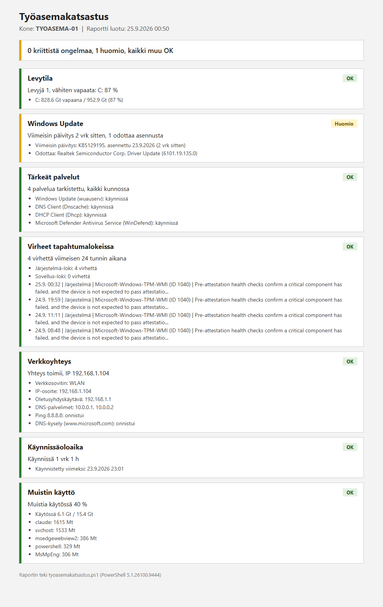

# Työasemakatsastus

PowerShell-skripti, joka tarkistaa Windows-koneen peruskunnon ja tekee tuloksista selkeän HTML-raportin.

## Miksi tein tämän

Kun käyttäjä ilmoittaa helpdeskiin, että "kone on hidas" tai "jokin ei toimi", tason 1 tuki käy yleensä läpi samat asiat: onko levy täynnä, milloin kone on viimeksi käynnistetty uudelleen, ovatko päivitykset jumissa, toimiiko verkko ja onko lokeissa virheitä. Käsin tehtynä tähän kuluu aikaa, ja tiedot pitää vielä kirjoittaa tikettiin.

Skripti tekee nämä tarkistukset kerralla. Omalla koneellani ajo kesti noin 12 sekuntia. Tuloksena on yksi HTML-tiedosto, jonka voi liittää tikettiin tai lähettää eteenpäin tason 2 tukeen. Värikoodauksesta näkee heti, mihin kannattaa tarttua ensin.

Opiskelen IT:tä Haaga-Heliassa, ja tämä on yksi IT-tuen portfolioni projekteista. Tein sen Claude Coden avustuksella.

## Mitä skripti tarkistaa

| Tarkistus | Huomio (keltainen) | Kriittinen (punainen) |
|---|---|---|
| Levytila kaikilta kiintolevyiltä | alle 15 % vapaana | alle 5 % vapaana |
| Windows Update | yli 30 vrk viimeisestä päivityksestä, odottavia päivityksiä tai uudelleenkäynnistys odottaa | |
| Tärkeät palvelut (Windows Update, DNS Client, DHCP Client, Defender) | palvelua ei löydy | palvelu pysähdyksissä tai poistettu käytöstä |
| Virheet Järjestelmä- ja Sovellus-lokeissa (24 h) | yli 10 virhettä | |
| Verkko: IP, yhdyskäytävä, DNS, ping 8.8.8.8, DNS-kysely | | ei yhdyskäytävää, ping tai DNS ei toimi |
| Käynnissäoloaika | yli 14 vrk ilman uudelleenkäynnistystä | |
| Muistin käyttö + 5 eniten muistia vievää ohjelmaa | yli 90 % | |

Jos jotain tietoa ei saada luettua (esim. oikeudet puuttuvat), kortti näytetään harmaana "Ei saatavilla" -tilassa, ja muut tarkistukset jatkuvat normaalisti.

Kynnysarvot ovat skriptin alussa, ja niitä voi muuttaa.

## Käyttö

Toimii Windows PowerShell 5.1:llä ja PowerShell 7:llä. Admin-oikeuksia tai lisämoduuleja ei tarvita.

```powershell
.\tyoasemakatsastus.ps1
```

Raportti tallentuu skriptin kansioon nimellä `tyoasemakatsastus_KONEENNIMI_vvvv-kk-pp.html`, ja lyhyt yhteenveto tulostuu konsoliin.

Windows estää oletuksena skriptien ajamisen (execution policy). Jos tulee virhe "running scripts is disabled on this system", skriptin voi ajaa niin, että lupa koskee vain tätä yhtä ajoa:

```powershell
powershell -ExecutionPolicy Bypass -File .\tyoasemakatsastus.ps1
```

Jos tiedosto on ladattu netistä, Windows voi merkitä sen estetyksi. Esto poistuu komennolla `Unblock-File .\tyoasemakatsastus.ps1`.

## Esimerkkiraportti



Raportti on oikeasta ajosta omalla koneellani 25.9.2026. Koneen nimi on vaihdettu muotoon TYOASEMA-01 ja operaattorin DNS-palvelinten osoitteet muotoon 10.0.0.1 ja 10.0.0.2. Muut tiedot ovat ajosta sellaisenaan. HTML-versio löytyy kansiosta [esimerkkiraportti](esimerkkiraportti/).

## Asioita, joita opin tätä tehdessä

- `Get-WinEvent` antaa virheen myös silloin, kun lokissa ei ole yhtään osumaa. Huomasin tämän testatessa, koska omassa Sovellus-lokissani ei ollut virheitä ja komento kaatui. Skripti tulkitsee tämän tilanteen nollaksi virheeksi eikä "ei saatavilla" -tilaksi.
- Windows Update -palvelu on oletuksena "Manual" ja käynnistyy vain tarvittaessa, joten pysäytetty tila on sille normaali. Jos kaikki pysäytetyt palvelut merkittäisiin punaisiksi, raportti hälyttäisi turhaan.
- Windowsin pikakäynnistys (Fast Startup) on päällä oletuksena, jolloin "Sammuta" ei oikeasti nollaa käynnissäoloaikaa. Siksi käyttäjä voi sanoa sammuttaneensa koneen eilen, vaikka se on ollut käynnissä kolme viikkoa. Ainoastaan "Käynnistä uudelleen" käynnistää koneen oikeasti alusta.
- PowerShell 5.1 lukee skriptin väärin, jos tiedostossa on ääkkösiä eikä sitä ole tallennettu UTF-8 BOM -muodossa.

## Jatkokehitysideoita

- Sähköposti-ilmoitus IT-tuelle, jos raportissa on kriittinen ongelma
- Ajastettu ajo Task Schedulerilla esim. kerran viikossa
- Tulosten vienti CSV-tiedostoon, jolloin trendejä (esim. levytilan hupenemista) voisi seurata ajan myötä
- Ajo etänä usealle koneelle kerralla (`Invoke-Command`)

## Tiedostot

```
tyoasemakatsastus.ps1   itse skripti
esimerkkiraportti/      esimerkki-HTML ja kuvakaappaus siitä
```
